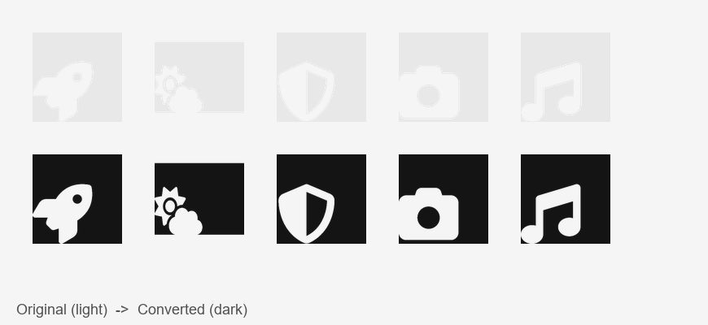

<div align="center">

# 🌙 Dark Mode Icon Converter

**Convert icons between light and dark variants so they stay visible on any background.**

A desktop GUI tool built with **CustomTkinter** and **Pillow** that analyzes each pixel, detects grayish colors, and converts them to a light or dark variant while preserving transparency and color tint.

[](https://www.python.org/)
[](https://github.com/TomSchimansky/CustomTkinter)
[](https://python-pillow.org/)
[](https://numpy.org/)
[](LICENSE)

> A small utility for designers and developers who need dark-mode-friendly icon variants.

</div>

---

## 📖 Overview

Dark Mode Icon Converter is a **desktop application** that converts icons between **light and dark variants** so they remain clearly visible on either background. It is ideal for:

- App/website icons that need a light-mode or dark-mode variant
- Toolbar and menu icons that disappear on light or dark themes
- Quick batch conversion of icon sets

The tool provides a **live before/after preview**, **batch processing**, **drag-and-drop**, and **configurable thresholds** so you can tune exactly which colors get converted. Choose a **direction** — `light_to_dark` or `dark_to_light` — to suit your needs.

---

## 🎨 Sample Icons

Here are **5 complex icons** (from the Font Awesome icon set) converted with the tool. The top row shows the **original light icons** (nearly invisible on a light background); the bottom row shows the **converted dark versions** produced by the converter.



| Icon | Original (light) | Converted (dark) |
|---|---|---|
| 🚀 Rocket | `samples/rocket.png` | `samples/rocket_dark.png` |
| ⛅ Cloud & Sun | `samples/cloud-sun.png` | `samples/cloud-sun_dark.png` |
| 🛡️ Shield | `samples/shield-halved.png` | `samples/shield-halved_dark.png` |
| 📷 Camera | `samples/camera.png` | `samples/camera_dark.png` |
| 🎵 Music | `samples/music.png` | `samples/music_dark.png` |

> 💡 **Result:** each light-gray pixel `(232, 232, 232)` was darkened to `(20, 20, 20)` — a clearly visible dark gray — while transparency and shape were fully preserved.

---

## ✨ Features

- User-friendly GUI interface
- Live preview of both original and converted icons
- **Two conversion directions**: `light_to_dark` and `dark_to_light`
- Batch processing of multiple files at once
- Drag-and-drop file support
- Supports various image formats (PNG, JPG, ICO, GIF, BMP, WEBP)
- Preserves transparency in icons
- Handles animated GIFs and multi-size ICOs
- Configurable conversion thresholds (gray tolerance, brightness threshold)
- Choose output folder and output format
- Fast vectorized (numpy) pixel processing

---

## 🧰 Tech Stack

| Layer | Technology |
|---|---|
| Language | Python 3.8+ |
| GUI | CustomTkinter 5.2+ |
| Imaging | Pillow 10.0+ |
| Pixel processing | NumPy 1.24+ (vectorized) |
| Drag & drop | tkinterdnd2 (optional) |
| Testing | Python `unittest` |

---

## 📁 Repository Structure

```text
dark-mode-icon-enhancer/
├── icon_converter.py          # Main application + core processing logic
├── test_icon_converter.py     # Unit tests for the processing pipeline
├── requirements.txt           # Runtime dependencies
├── pyproject.toml             # Packaging + console entry point
├── samples/                   # Sample icons (original + converted)
│   ├── rocket.png / rocket_dark.png
│   ├── cloud-sun.png / cloud-sun_dark.png
│   ├── shield-halved.png / shield-halved_dark.png
│   ├── camera.png / camera_dark.png
│   ├── music.png / music_dark.png
│   └── comparison.png         # Before/after grid used in this README
└── README.md                  # This file
```

---

## 🔨 Installation

### Requirements

| Component | Notes |
|---|---|
| Python | 3.8 or higher |
| OS | Windows, macOS, or Linux |

### Install dependencies

```bash
pip install -r requirements.txt
```

Or install as a package:

```bash
pip install -e .
```

---

## 🚀 Usage

### Run the app

```bash
python icon_converter.py
```

### Steps

1. Click **"Select Icon(s)"** to choose your icon files (or drag-and-drop them onto the window)
2. Choose a **direction** (`light_to_dark` or `dark_to_light`)
3. Optionally pick an **output folder** and **output format**
4. Adjust the **conversion thresholds** (gray tolerance, brightness threshold) if needed
5. Click **"Convert"**
6. The app shows a preview of both the original and converted icons
7. Converted icons are saved with `_dark` or `_light` added to the filename

### Programmatic use

The core processing functions can also be used directly:

```python
from pathlib import Path
import icon_converter as ic

# Convert a light icon to a dark variant
ic.save_processed(
    Path("icon.png"),
    Path("icon_dark.png"),
    output_format="PNG",
    direction="light_to_dark",
)
```

---

## ⚙️ How it works

The application analyzes each pixel in your icon:

- Detects **grayish** colors (low RGB variance)
- In `light_to_dark` mode, darkens pixels **lighter** than the brightness threshold
- In `dark_to_light` mode, lightens pixels **darker** than the brightness threshold
- Keeps other colors unchanged
- Maintains transparency

The pixel loop is **vectorized with NumPy** for speed, and multi-frame images (animated GIFs, multi-size ICOs) are processed frame-by-frame.

---

## 🧪 Running tests

```bash
python -m unittest test_icon_converter
```

The suite covers pixel conversion logic, transparency handling, format round-trips, animated GIF preservation, and output-path building.

---

## ⚠️ Troubleshooting

If you get any errors:

1. Make sure Python is installed and added to your system's PATH
2. Try running the `pip install` command again
3. Make sure you have all the files in the same folder
4. For drag-and-drop support, ensure `tkinterdnd2` is installed

---

## 📄 License

MIT

---

<div align="center">
  Made with ❤️ for dark-mode-friendly icons
</div>
